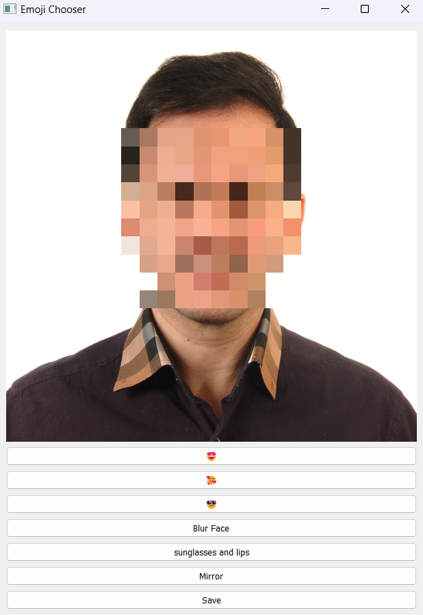

# Face Detector

A program to open a photo and apply some filters to your face

## How to install 
Run following command:

```
pip install -r requirements.txt
```
## How to run
execute this command in terminal:

```
python main.py 
```

## Result 

